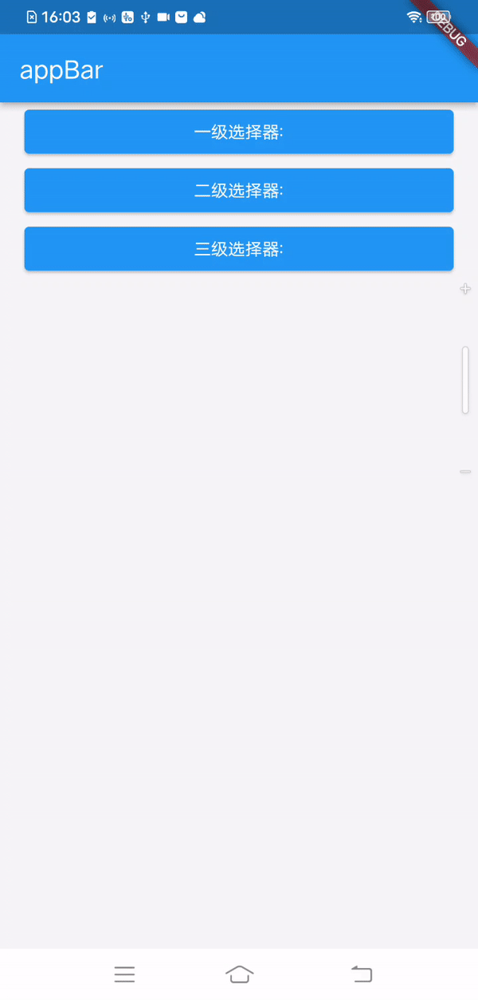
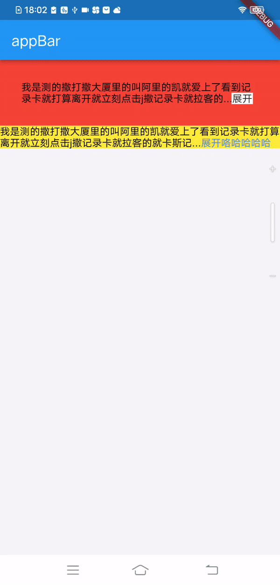
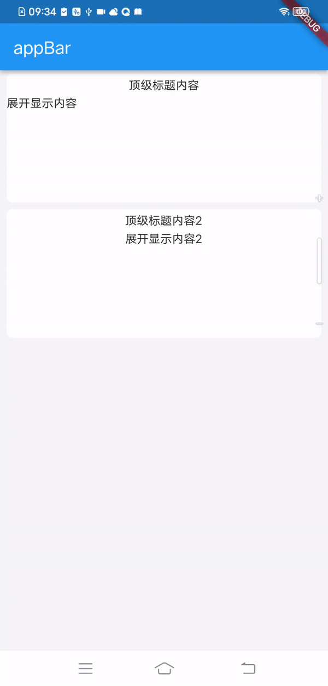
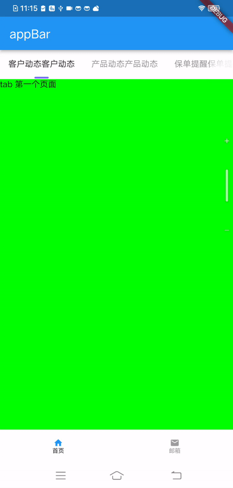

# 介绍
一个实现了开发中常用的组件的库
# 使用前先看看效果吧
-  #### 轮播模块（轮播组件）《指示器录屏时失真》

- #### 选择器模块（适配器模式的万能选择器<上限三级>）

- #### 文本显示展开收起组件（支持设置容器、文本的收起和展开占位）

- #### 容器内部展开和收起组件

- #### 弹窗模块（涵盖了Dialog以及PopWindow）

- #### 顶部、底部导航栏模块

- #### 展示/输入类模块

# 快速开始
## 安装
## 引入依赖文件
```dart
import 'package:widget/widget.dart';
```
# 一起来使用看看
-  #### 轮播模块（轮播组件）
```dart
        Swiper(
              height: 188,//设置容器高度
              swiperConfig: SwiperConfig(
                itemCount: 5,//需要匹配初始化的个数
                itemBuilder: (index) {
                  //返回具体需要显示的组件信息
                  return Container(
                    //截取超出部分，并为边缘抗锯齿
                    clipBehavior: Clip.antiAlias,
                    //设置圆角
                    decoration: BoxDecoration(
                        color: Colors.black12,
                        borderRadius: BorderRadius.circular(10)),
                    margin: EdgeInsets.fromLTRB(8, 8, 8, 11),
                    //具体显示内容渲染
                    child: Image.asset(
                      'images/app_ic_welcome_bg.png',//PS：直接使用时，请更换图片名称，更换为本地存在的图片
                      fit: BoxFit.fill,
                    ),
                  );
                },
                itemIndicatorBuilder: (index, currentIndex) {
                  //返回自定义指示器的样式
                  return Container(
                    height: 3,
                    width: 3,
                    decoration: BoxDecoration(
                        borderRadius: BorderRadius.circular(3),
                        //每次切换都需要重新刷新页面，重绘指示器样式
                        color:
                            currentIndex == index ? Colors.red : Colors.blue),
                  );
                },
                //关闭自动轮播功能
                autoplay: false,
              ),
            )
```

- #### 选择器模块（适配器模式的万能选择器<上限三级>）
```dart
///一级选择器，通过适配器模式将普通数据转化成PickerView能识别的数据，进行页面展示
 showModalBottomSheetDialog(context, PickerView(TestData().getAge(),submitCallBack: (dynamic result){
                PickerResult data = result;
                setState((){
                  //选中的适配器的结果内容
                  checkContent1 = data.primaryName;
                });
              },
              //默认选中的数据，要和显示内容完全一致才能匹配上
              defaultPickerData: ["20"],));

///适配器对象（渲染数据源）
class TestData extends PickerDataAdapter {
  List getAge() {
    List<String> ageList = [];
    for (int i = 0; i < 100; i++) {
      ageList.add("$i");
    }
    return convertData(ageList);
  }

  //当前返回的就是一个普通数据，这里做一次封装，用于后续统一处理
  //处理当前的数据结构并返回
  @override
  List convertData(List<dynamic> listData) {
    List list = [];
    for (String item in listData) {
      //处理完毕当前的内容之后进行返回
      //primaryName：界面上显示的内容，primaryCode：点击确定后可能用于标识内容的id或其他信息（与后端交互的信息可存储到该字段中）
      list.add(PickerResult(primaryName: item, primaryCode: item + item));
    }

    return list;
  }
}
```

```dart
///二级选择器，通过适配器模式将普通数据转化成PickerView能识别的数据，进行页面展示
  showModalBottomSheetDialog(context, PickerView(TestData3().getDate(),submitCallBack: (dynamic result){
                PickerResult data = result;
                setState((){
                  //选中的适配器的结果内容
                  checkContent2 = data.primaryName + data.secondaryName;
                });
              },
              //默认选中的数据，要和显示内容完全一致才能匹配上
              defaultPickerData: ["1999年","10月"],));

 ///适配器对象（渲染数据源） 
 class TestData3 extends PickerDataAdapter{

  List getDate() {
    List<int> date = [];
    //可以获取本地数据进行匹配
    //这里只需要统计年份区间即可，月日基本
    for (int i = 1960; i < 2050; i++) {
      date.add(i);
    }

    return convertData(date);
  }

  @override
  List convertData(List<dynamic> listData) {
    List list = [];
    for (int item in listData) {
      PickerResult pickerResultYear = PickerResult();
      pickerResultYear.primaryName = "$item年";
      pickerResultYear.primaryCode = "$item";

      //遍历子容器
      //每年都有12月份
      List listMonth = [];
      for(int i = 1;i<=12;i++){
        PickerResult pickerResultMonth = PickerResult();
        pickerResultMonth.primaryName = "$i月";
        pickerResultMonth.primaryCode = "$i";

        listMonth.add(pickerResultMonth);
      }

      pickerResultYear.childList = listMonth;
      list.add(pickerResultYear);
    }

    return list;
  }
             
```
```dart
///三级选择器，通过适配器模式将普通数据转化成PickerView能识别的数据，进行页面展示
       showModalBottomSheetDialog(context, PickerView(TestData2().getArea(),submitCallBack: (dynamic result){
                PickerResult data = result;
                setState((){
                  //选中的适配器的结果内容
                  checkContent3 = data.primaryName + data.secondaryName + data.tertiaryName;
                });
              },defaultPickerData: ["浙江省1","天津城区1","1 小门台"],));
            }, child: Text("三级选择器:$checkContent3")),

 ///适配器对象（渲染数据源） 
 class TestData2 extends PickerDataAdapter {
  List getArea() {
    List<InsureAreaInfo> date = [];
    for (int i = 0; i < 20; i++) {
      InsureAreaInfo info = InsureAreaInfo(
          insureProvince: "$i 0000",
          insureProvinceName: "浙江省$i",
          cityList: i != 0
              ? [
                  CityListBean(insureCity: "120100 $i", insureCityName: "天津城区$i",areaList: [AreaListBean(insureArea: "666 $i",insureAreaName:  "$i 大门台"),
                    AreaListBean(insureArea: "888 $i",insureAreaName:  "$i 小门台")]),
                  CityListBean(insureCity: "220100 $i", insureCityName: "杭州城区$i")
                ]
              : []);

      date.add(info);
    }

    return convertData(date);
  }

  //当前返回的就是一个普通数据，这里做一次封装，用于后续统一处理
  //处理当前的数据结构并返回
  @override
  List convertData(List<dynamic> listData) {
    List list = [];
    for (InsureAreaInfo item in listData) {
      //处理完毕当前的内容之后进行返回

      if (item.cityList.isNotEmpty) {
        List<PickerResult> childResult = [];
        for (int i = 0; i < item.cityList.length; i++) {
          CityListBean cityListBean = item.cityList[i];

          List areaList = [];
          if(cityListBean.areaList.isEmpty){
            areaList.add(PickerResult(primaryCode: cityListBean.insureCity,primaryName: cityListBean.insureCityName));
          }else{
            for(AreaListBean areaListBean in cityListBean.areaList){
              areaList.add(PickerResult(primaryCode: areaListBean.insureArea,primaryName: areaListBean.insureAreaName));
            }
          }

          childResult.add(PickerResult(
              primaryName: cityListBean.insureCityName,
              primaryCode: cityListBean.insureCity,childList: areaList));
        }

        list.add(PickerResult(
            primaryName: item.insureProvinceName,
            primaryCode: item.insureProvince,
            childList: childResult));
      } else {
        list.add(PickerResult(
            primaryName: item.insureProvinceName,
            primaryCode: item.insureProvince,
            childList: [
              PickerResult(
                  primaryName: item.insureProvinceName,
                  primaryCode: item.insureProvince,childList: [PickerResult(primaryCode: item.insureProvince,primaryName: item.insureProvinceName)])
            ]));
      }
    }
    

    return list;
  }
}
```
- #### 文本显示展开收起组件（支持设置容器、文本的收起和展开占位）
```dart
///模式一：自定义组件跟随在文本后面。PS：expandContainer和collapseContainer必须为Container并且设置constraints的maxWidth属性
 Container(
              padding: EdgeInsets.all(30),
              color: Colors.red,
              child:ExpandedText(
                textCollapseConfig: TextCollapseConfig(
                    expandContainer: Container(
                      alignment: Alignment.center,
                      color: Colors.white,
                      constraints: BoxConstraints(
                        maxWidth: 30,//必填项,组件获取尺寸的标准信息
                      ),
                      child: Text('展开'),
                    ),
                    collapseContainer: Container(
                      color: Colors.white,
                      alignment: Alignment.center,
                      constraints: BoxConstraints(
                        maxWidth: 260,//必填项
                      ),
                      child: Text('收起'),
                    ),
                    contentText:
                    '我是测的撒打撒大厦里的叫阿里的凯就爱上了看到记录卡就打算离开就立刻点击j撒记录卡就拉客的就卡斯记录撒旦萨达就打开拉萨的了啊撒角度来看按时间了就大山大河大家哈空间爱试的文本'),
              ),
            )

///模式二：默认使用TextCollapseConfig属性类中的文本跟随到页面上文本的最后
  Container(
              color: Colors.yellow,
              child:ExpandedText(
                textCollapseConfig: TextCollapseConfig(
                    //默认显示展开
                    isExpanded:true,
                    contentText:
                    '我是测的撒打撒大厦里的叫阿里的凯就爱上了看到记录卡就打算离开就立刻点击j撒记录卡就拉客的就卡斯记录撒旦萨达就打开拉萨的了啊撒角度来看按时间了就大山大河大家哈空间爱试的文本'),
              ),
            )
```
- #### 容器内部展开和收起组件
```dart
Collapse(
              collapseConfig: CollapseConfig(
                //默认状态设置为展开
                 isExpanded:true,
                //设置收起展开模式，内容尺寸平铺开来动画过渡
                  animType: AnimType.translate,
                  containerMargin: EdgeInsets.fromLTRB(8, 4, 8, 4),
                  boxDecoration: BoxDecoration(
                      color: Colors.white,
                      borderRadius: BorderRadius.circular(7)),
                  //默认展示的布局信息
                  collapseItemBuilder: Container(
                    height: 27,
                    alignment: Alignment.center,
                    child: Text('顶级标题内容'),
                  ),
                  //展开后，额外显示的布局
                  expandChildItemBuilder: Container(
                    height: 127,
                    child: SizedBox(
                      child: Text('展开显示内容'),
                    ),
                  ),
                  operatorCollapseCallBack: (_) {
                    //返回展开状态，_:true展开，false收起
                  }),
            )
```
- #### 弹窗模块（涵盖了Dialog以及PopWindow）
```dart
///使用注意事项：在入口文件中的MaterialApp中需要实现属性设置
///1.navigatorObservers:[FlutterSmartDialog.observer] <主要用于路由的监听，系统的弹窗实际上是添加了一级路由，需要手动和普通弹窗整合管理>
///2.builder:FlutterSmartDialog.init(loadingBuilder: (msg) => CenterLoadingView(msg), toastBuilder: (msg) => CenterToast(msg)),) <可缺省，用于初始化渲染时设置全局toast、loading样式>

///toast使用
  void _showToast() async {
    await SmartDialog.showToast('toast弹窗测试');
  }

///loading使用
  void _showLoading() async {
    //同时调用多个，在当前存在的情况，生效的也只有一个，避免短时间内多个覆盖闪烁问题
    await SmartDialog.showLoading(displayTime:const Duration(seconds: 2),onDismiss: (){
      //弹窗消失之后回调
    });//提前设置好需要自动关闭的时长

    //不会自动消失，需要手动设置消失时间,或者物理键返回
    // await SmartDialog.showLoading();
  }

///自定义dialog使用，区别于系统弹窗<使用Overlay组件实现，切换页面需要隐藏，切回来时需要显示  -  已实现>
void _showCustomDialog() async{
    //使用自定义弹窗
    SmartDialog.show(useSystem: false,animationType: SmartAnimationType.scale,builder: (context){
      return CenterDialogView(title: "我的hi是的健身卡了解到撒娇的拉萨机卢卡斯简单快乐吉萨拉开大家拉萨看就是啦",
          contentColor:Color(0XFF969799),
          content: "dlsadjskl的撒拉开大家卡拉就离开洒家卢卡斯记录看的就爱上了捡垃圾的老咔叽的拉客的就撒赖扩大就拉山口觉得拉睡觉了卡死了的就爱上了看到就",
          cancelBtn: "辅助操作",
          confirmBtn: "主要操作",cancelCallBack: (dynamic object){
            print("取消按钮");
            SmartDialog.dismiss();
          },confirmCallBack: (dynamic object){
            print("确认-按钮");
            SmartDialog.dismiss();
          });
    });
  }

///自定义popwindow使用。PS：需要使用PopWindowHelper的Context用于定位PopWindow展现的位置
 PopWindowHelper(child: Container(
                height: 30,
                width: 200,
                color: Colors.blue,
                alignment: Alignment.center,
                child: Text('自定义popwindow居于下方',style: TextStyle(color: Colors.white),),
              ),contextCallBack: (_){
                _showCustomPopWindow(_);
              },)


 void _showCustomPopWindow(BuildContext context) async{
    //使用时要明确使用的组件的位置，一般使用请将响应的组件抽取出来，单独放置使用
    SmartDialog.showAttach(
      targetContext: context,
      maskColor: Colors.transparent,
      alignment: Alignment.bottomRight,
      animationType: SmartAnimationType.scale,
      //配合animationType设置SmartAnimationType.scale使用，按照坐标开始缩放
      scalePointBuilder: (selfSize) => Offset(selfSize.width/2, 0),
      builder: (_) {
        return Container(height: 50, width: 30, color: Colors.red);
      },
    );
  }


```
- #### 顶部、底部导航栏模块
```dart
///底部导航器使用，底部按钮完全开放自定义图片和文本样式，实现对应属性即可
BottomNavigator(lightIcons: [
      Icon(
        Icons.home,
        color: Colors.blue,
        size: 16,
      ),
      Icon(
        Icons.email,
        color: Colors.blue,
        size: 16,
      ),
    ], normalIcons:
    [
      Icon(
        Icons.home,
        color: Colors.grey,
        size: 16,
      ),
      Icon(
        Icons.email,
        color: Colors.grey,
        size: 16,
      ),

    ], navTitles: [
      '首页','邮箱',
    ], pages: [
      FirstPage(),
      SecondPage(),
    ])


///顶部导航器使用
TabBarNavigator(
      titles: data,//显示的title信息，示例：["客户动态客户动态", "产品动态产品动态", "保单提醒保单提醒", "其他消息其他消息"]，主要是用于实现右侧阴影计算模块。可以不传，右侧就不会有模糊的遮罩
      isScrollable: true,//是否平均分，如果true则是自己内部宽度自适应，false则是平均分内容占位
      switchTopTabListener: (currentIndex, preIndex) {
        //从 $preIndex 到 $currentIndex
        //例如：取消当前高亮数据
      },
      tabs: [
        //具体显示顶部标题的组件列表
        TabTitleView(data[0]),
        TabTitleView(data[1]),
        TabTitleView(data[2]),
        TabTitleView(data[3]),
      ],
      pages: [
        //具体页面列表
        TabFirstPageView(),
        TabSecondPageView(),
        TabThirdPageView(),
        TabFourthPageView()
      ],
    )
```
- #### 展示/输入类模块
```dart
///输入框如果需要在被软键盘挡住的时候浮在软键盘上方，使用ScrollView嵌套即可

            ///携带标题信息的输入内容文本<输入内容靠左（默认）>-样式一
            InputBoxView(
              "标题标题",
              "请输入",
              onTextChanged: (value) {
                //输入的文本内容，每次输出最新的文本
              },
              //是否携带底部分割线
              showSplitLine: false,
            ),

            ///携带标题信息的输入内容文本<输入内容不靠左，即靠右>-样式二
            InputBoxView(
              "标题标题",
              "请输入",
              onTextChanged: (value) {
               //输入的文本内容，每次输出最新的文本
              },
              //默认是水平输入样式isHorizontalType：true 默认。false：标题和输入框上下展示
              isHorizontalType: true,
              //默认输入文本是靠左对齐，设置false之后就右对齐
              inputGravityLeft: false,
            ),

            ///标题和输入内容上下排版样式
            InputBoxView(
              "标题标题",
              "请输入",
              onTextChanged: (value) {
               //输入的文本内容，每次输出最新的文本
              },
              isHorizontalType: false,
              inputGravityLeft: true,
              showSplitLine: true,
            ),

            ///一定携带图片的点击响应样式
            SelectionBoxView(
              "标题标题",
              content: "内容",
              titleRightView: Icon(
                Icons.home,
                size: 16,
              ),
              titleLeftView: Icon(
                Icons.home,
                size: 16,
              ),
              click: () {
                //点击事件
              },
              rightView: Icon(
                Icons.home,
                size: 16,
              ),
            ),

            ///显示内容文本居左侧选择样式，携带右侧箭头
            SelectionBoxView(
              "标题标题",
              content: "请选择",
            ),

            ///显示内容文本居右侧选择样式，携带右侧箭头
            SelectionBoxView(
              "标题标题",
              //设置显示内容的位置，默认居左
              contentAlign: TextAlign.right,
              content: "请选择靠边",
            ),

            ///纯输入框并设置对应样式
            TextInputBoxView(
              88,
              4,
              "请输入",
              onTextChanged: (item) {
                //输入内容监听
              },
              primaryPadding: [16, 8, 16, 8],
              secondaryColor: Colors.white,
              secondaryPadding: [0, 0, 0, 0],
            ),

            ///纯输入框样式
            TextInputBoxView(
              //设置最大高度
              88,
              //设置最大长度
              4,
              //设置没用输入时的占位内容
              "请输入",
            ),

            ///发送验证码样式
            Padding(
              padding: EdgeInsets.all(20),
              child: InputTimerView(
                //显示没有内容的占位内容
                "请输入验证码",
                //设置输入上限
                6,
                textInputType: TextInputType.number,
                onTextChanged: (value) {
                  //value：输入的验证码
                },
                triggerClickEvent: () {
                  //点击倒计时信息回调
                },
              ),
            )

```
# 感谢使用！
